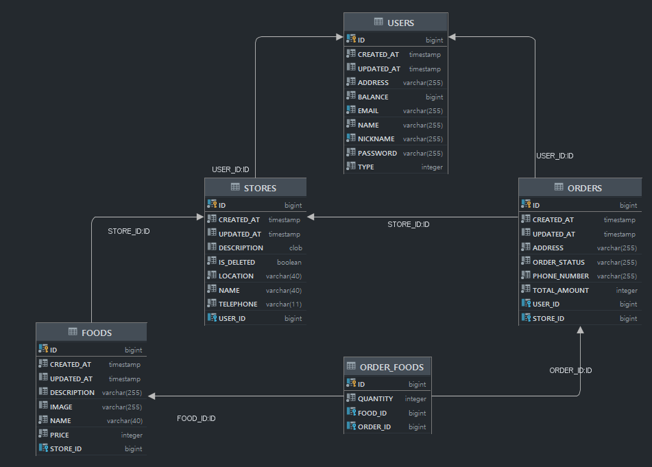
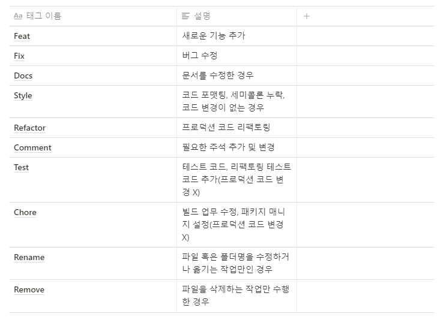

# BEDV1_Kyu
뀨팀 배달의 민족 클론코딩

## 개발환경
```
Language :  Java 11
빌드 도구 : Gradle
DB : mysql
Test DB : h2
서버 : aws
이슈 관리 : 깃허브 issue, 칸반보드
```

## ERD


## API 설계

- 음식점 관리

`GET /stores` : 음식점 목록 조회 API

`POST /stores` : 음식점 등록 API

`GET /stores/{storeId}` : 음식점 조회 API

- 이미지 파일 업로드

`POST api/v1/images` : 음식 이미지 업로드 API

- 메뉴 관리

`POST /stores/{storeId}/foods` : 메뉴 음식 등록 API

`GET /stores/{storeId}/foods/{foodId}` : 단일메뉴 조회 API

- 주문 시스템

`POST /orders` : 주문 생성 API

`GET /orders/{order_id}` : 주문 조회 API

`PATCH /orders/{order_id}` : 주문 수정 API

## commit 컨벤션


- [ Prefix: #이슈번호 ] : commit 메시지
```
// 예시 커밋 타이틀 
[feat: #1] Person 나이 30으로 제한
```

